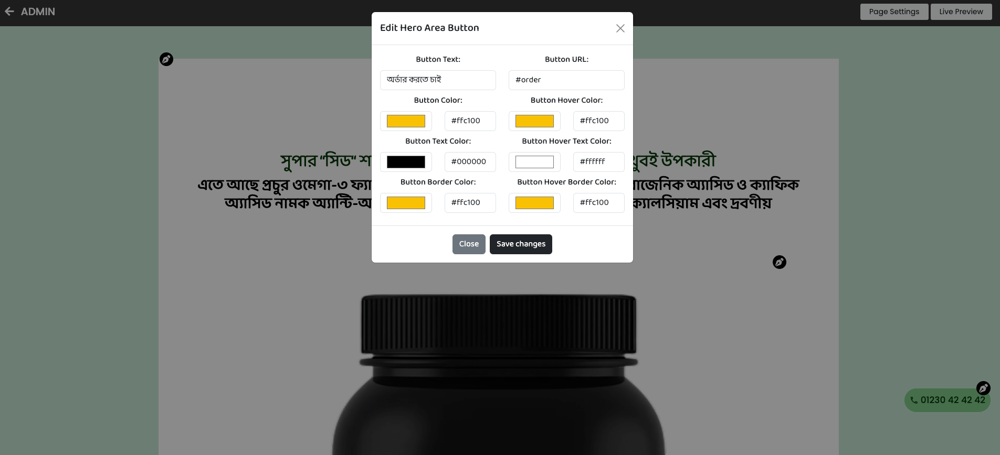

# 1Commerce: One-Page Shop Builder

1Commerce is the ultimate platform for small and medium-sized enterprises (SMEs) to craft and launch high-converting single page shops with ease. With an intuitive real-time customization, and niche product optimization, businesses can showcase their products effortlessly. Powered by PHP, Laravel, Vue.js, and Bootstrap, it delivers a seamless, responsive, and scalable experience across all devices. Whether you're a startup or an established brand, 1Commerce transforms your ideas into stunning single page shops—without the hassle of coding.

---

## ✨ Features

### 🎨 Shop Customization

-   **Real-Time Editor** – Customize your shop's appearance and layout in real-time with an intuitive interface
-   **Live Preview** – See changes instantly as you make them, ensuring your shop looks perfect
-   **Mobile-First Design** – Fully responsive layouts that work seamlessly across all devices
-   **Custom Templates** – Choose from a variety of pre-designed templates for quick setup

### 💼 Business Tools

-   **Product Management** – Easy-to-use interface for managing products, inventory, and pricing
-   **Free Subdomain** – Get a free subdomain to host your shop
-   **Custom Domain Setup** – Set up a custom domain for each shop
-   **Order Tracking** – Monitor and manage orders from a centralized dashboard
-   **Customer Order Management** – Manage customer orders, and view order history
-   **Payment Management** – Streamlined processes for managing transactions and refunds
-   **Analytics Dashboard** – Track sales, visitor behavior, and other key metrics
-   **SEO Optimization** – Built-in tools to improve your shop's search engine visibility
-   **Support Ticketing** – Raise support tickets for assistance with your shop
-   **1Wallet** – Custom wallet system for receiving order payments
-   **1Wallet Activation** – Activate the 1Wallet feature for each shop
-   **Transaction History** – View all transactions in the 1Wallet dashboard
-   **Cash Withdrawal** – Withdraw cash from your 1Wallet balance
-   **Subscription Management** – Manage subscription plans, billing cycles, and customer subscriptions with ease
-   **Subscription Package Management** – Manage package plans, pricing, and features from the admin panel

### 💳 Payment Solutions

-   **Multiple Gateways** – Support for various payment methods including:
    -   AamarPay – Secure payment gateway for local transactions
    -   Stripe – Global payment processing (coming soon)
    -   bKash – Mobile financial services integration (coming soon)
-   **Secure Transactions** – PCI-compliant payment processing for customer safety

---

## 🛠️ Technologies

-   **Backend**: PHP, Laravel
-   **Frontend**: Bootstrap, Vue.js
-   **Database**: MySQL
-   **Version Control**: Git
-   **Package Manager**: Composer (PHP), npm (JavaScript)

---

## 🎥 Demo

You can browse the live demo of the 1commerce at the following link:

[](https://1commerce.qtecsolution.com/)

### Dashboard:


### Order Management:


### Support Ticket:


### Template Store:


### My Templates:


### Real-time Page Edit:





### 1wallet:


### Cash Withdrawal:


### Transaction History:


### Withdrawal History:


### Subscription Management:


### Custom Domain Setup:


### Admin Dashboard:


### Subscription Package Management:


### Withdrawal Management:


### Support Ticket Management:


## 📦 Installation

Welcome to the setup guide for the **1Commerce**. This document provides comprehensive steps to install, configure, and run the project in your local environment, using both Docker and a native setup. Follow these instructions to ensure proper configuration.

## 📝 Prerequisites

Please ensure you have the following installed on your system:

-   **PHP** (version 8.1 or higher)
-   **Composer**
-   **npm**
-   **MySQL** (version 8.0 or compatible, e.g., MariaDB)
-   **Git**

## 📈 Server Requirements

This application requires a server with the following specifications:

-   **PHP** (version 8.1 or higher) with the extensions:
    -   Ctype
    -   Fileinfo
    -   JSON
    -   Mbstring
    -   PDO
    -   GD
    -   Zip
    -   PDO MySQL
-   **MySQL** (version 8.0) or **MariaDB**
-   **Composer**
-   **Web Server**: Apache or Nginx

## ⚙️ Setup Options

This guide covers two setup methods:

1. **Setting Up Locally (Without Docker)**
2. **Using Docker**

### 🚀 Setup Without Docker

#### 1. Clone the Repository

```bash
git clone https://github.com/qtecsolution/1commerce.git
```

```bash
cd 1commerce
```

#### 2. Install PHP Dependencies & NPM Dependencies

Within the project directory, run:

```bash
composer install
```

```bash
npm install
```

#### 3. Configure the Environment

Create the `.env` file by copying the sample configuration:

```bash
cp .env.example .env
```

#### 4. Generate Application Key

Secure the application by generating a key:

```bash
php artisan key:generate
```

#### 5. Configure Database

1. **Access MySQL**:

    ```bash
    mysql -u {username} -p
    ```

2. **Create Database**:

    ```sql
    CREATE DATABASE 1commerce_db;
    ```

3. **Grant User Permissions**:

    ```sql
    GRANT ALL ON 1commerce_db.* TO '{your_username}'@'localhost' IDENTIFIED BY '{your_password}';
    ```

4. **Apply Changes and Exit**:

    ```sql
    FLUSH PRIVILEGES;
    EXIT;
    ```

5. **Update `.env` Database Settings**:

    ```plaintext
    DB_CONNECTION=mysql
    DB_HOST=127.0.0.1
    DB_PORT=3306
    DB_DATABASE=1commerce_db
    DB_USERNAME={your_username}
    DB_PASSWORD={your_password}
    ```

#### 6. Run Migrations and Seed Data

To set up the database tables and populate them with initial data, run:

```bash
php artisan migrate --seed
```

#### 7. Start the Development Server

To run the application locally, execute:

```bash
php artisan serve
```

```bash
npm run dev
```

Your application will be available at [http://localhost:8000](http://localhost:8000).

---

### 🐳 Setup with Docker

#### 1. Clone the Repository

```bash
git clone https://github.com/qtecsolution/1commerce.git
```

```bash
cd 1commerce
```

#### 2. Initialize the Project

```bash
make setup
```

The application should now be accessible at [http://localhost](http://localhost).

#### Available Docker Commands

-   **Manage Container**

```bash
make docker-up
```

```bash
make docker-down
```

-   **Install Dependencies**

```bash
make composer-install
```

```bash
make composer-update
```

-   **Set File Permissions**

```bash
make set-permissions
```

-   **Generate Application Key**

```bash
make generate-key
```

-   **Run Migrations**

```bash
make migrate
```

-   **Run Migrations and Seed the Database**

```bash
make migrate-fresh-seed
```

-   **Setup Environment File**

```bash
make setup-env
```

-   **Link Storage Files**

```bash
make storage-link
```

## 🛠️ Additional Information

-   **Seeding**: The database seeder is configured to populate initial data. Run `php artisan migrate --seed` to use it.
-   **Environment Variables**: Ensure all necessary environment variables are set in the `.env` file.
-   **Database Configuration**: The application is configured for MySQL by default. Update the `.env` file as needed for other database connections.

## 🤝 Contributing

This is an open source project and contributions are welcome. If you are interested in contributing, please fork the repository and submit a pull request with your changes. The project maintainers will review and merge your changes accordingly.

## 📝 License

The 1commerce project is open source and available under the MIT License. You are free to use, modify, and distribute this codebase in accordance with the terms of the license.

Please refer to the LICENSE file for more details.

## Support

If you encounter any issues or have questions, feel free to reach out through the following channels:

-   Open an issue on the [GitHub repository](https://github.com/qtecsolution/AI-Content-Image-Generator-SaaS).
-   **Call for Queries**: +8801313522828 (WhatsApp)
-   **Contact Form**: [Qtec Solution Contact Page](https://qtecsolution.com/contact-us)
-   **Email**: [info@qtecsolution.com](mailto:info@qtecsolution.com)

## Follow Us on Social Media

Stay updated with the latest news, updates, and releases:

 <br>
[](https://qtecsolution.com/Qtec-Solution-Limited-Portfolio.pdf)
[](https://www.facebook.com/QtecSolution/)
[](https://www.instagram.com/qtecsolution/)
[](https://www.linkedin.com/company/qtec-solution)
[](https://twitter.com/qtec_solution)
[](https://www.youtube.com/@qtecsolutionlimited)
[](https://qtecsolution.com/)
